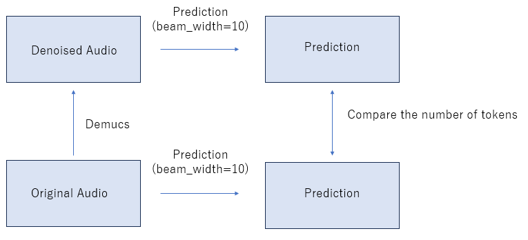
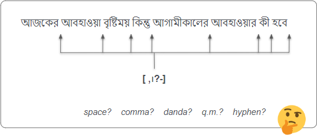

### 3rd place solution

First of all, we want to thank the competition organizers who hosted this fantastic competition and gave us an excellent opportunity to learn how to improve the ASR model against low-resource languages like Bengali and other competitors who generously shared their knowledge.
The following is a brief explanation of our solution. We will open-source more detailed codes later, but if you have questions, ask us freely.

---

#### Model Architecture

- CTC
  We fine-tuned "ai4bharat/indicwav2vec_v1_bengali" with competition data(CD).
  We observed low-quality samples in CD, and mindlessly fine-tuning a model with all the CD deteriorated its performance. So first, we fine-tuned a model only with split=”valid” CD (this improved the model’s performance) and predicted with it against split=”train” CD. After that, we included a high-quality split=’train’ CD (WER<0.75) to split=’valid’ CD and fine-tuned "ai4bharat/indicwav2vec_v1_bengali" from scratch.
  This improved the public baseline to LB=0.405.

- kenlm
  Because there are many out-of-vocabulary in OOD data, we thought training strong LM with large external text data is important. So we downloaded text data and script of ASR datasets(CD, indicCorp v2, common voice, fleurs, openslr, openslr37, and oscar) and trained 5-gram LM.
  This LM improved LB score by about 0.01 compared with "arijitx/wav2vec2-xls-r-300m-bengali"

<b>Data</b>

- audio data
  We used only the CD. As mentioned in the Model Architecture section, we did something like an adversarial validation using a CTC model trained with split=’valid’ and used about 70% of the all CD.

- text data
  We used text data and script of ASR datasets(CD, indicCorp v2, common voice, fleurs, openslr, openslr37, and oscar). As a preprocessing, we normalized the text with bnUnicodeNormalizer and removed some characters('[\,\?.!-\;:\"\।\—]').

<b>Inference</b>

- sort data by audio length
  Padding at the end of audios negatively affected CTC, so we sorted the data based on the audio length and dynamically padded each batch. This increased prediction speed and performance.

- Denoising with Demucs, a music source separation model.
  We utilized Demucs to denoise audios. This improved the LB score by about 0.003.

- Judge if we use Demucs or not
  Demucs sometimes make the audio worse, so we evaluated if the audio gets worse and we switched the audio used in a prediction. This improved the LB score by about 0.001.
  The procedure is as follows.

1.  we made two predictions: prediction with Demucs and prediction without Demucs. To speed up this prediction, we made the LM parameter beam_width=10.
2.  we compared the number of tokens in two predictions. If the number of tokens in the prediction with Demucs is shorter than the other, we predicted without Demucs. Otherwise, we predicted with Demucs.

<b>Post Processing</b>

- punctuation model
  We built models that predict punctuations that go into the spaces between words. These improved LB by more than 0.030.
  
  As a tip for training, the CV score was better improved by setting the loss weight of "PAD" to 0.0.
  Backborn: xlm-roberta-large, xlm-roberta-base
  Trainer: XLMRobertaForTokenClassification
  Dataset: train.csv (given), indicCorp v2
  Punctuations: [ ,।?-]

---
