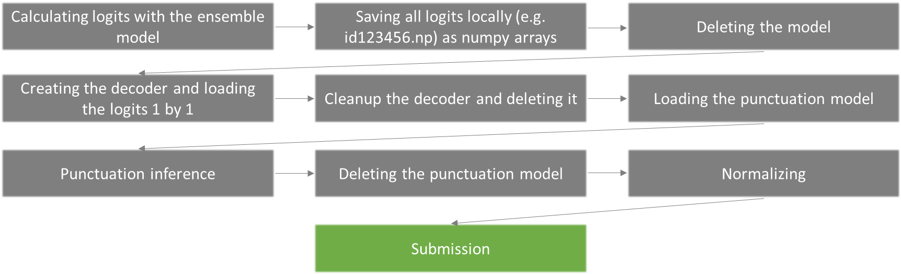

### 5th place solution - ensembling works

Thank you for organizing this competition so well. Whenever questions arose, the hosts responded promptly and clearly. I really enjoyed working on this problem. Thank you very much @imtiazprio

<b>Modeling</b>
Like most of the participants, I started with the YellowKing pipeline. I changed the backbone to IndicWav2Vec and reinitialized the CTC layer. With this method and the public Dari/normalizing pipeline, it was already possible to achieve 0.48x scores without a Language Model. However, there was a big problem: <b>the local WER score did not match the public lb anymore if the model was trained for too long.</b> At a learning rate of 3e-5, local overfitting started at 40k steps (batch size 16). I suspect that the model started learning the relationship of erroneous audio/annotation pairs.

Due to the noisy annotation, I excluded all samples with a mos-score of >2.0 in the subsequent training stage, reaching a score of 0.472. After re-labeling with the new model, I removed all samples with a WER above 0.5 for my model and a WER above 0.5 for YellowKing. <b>This resolved the local overfitting issue,</b> ensuring that local improvements correlated with better public lb scores. I trained the model over 210k steps (bs 16) with a learning rate of 8e-5, achieving a score of 0.452 without a language model on top.

Additionally, I trained a model with a [larger backbone](https://huggingface.co/facebook/wav2vec2-xls-r-1b). Unfortunately, due to lack of time, I could not fully exploit the potential, but after 135k steps I could already achieve a score of 0.454. The learning rate for the larger model had to be much smaller (1e-5).

<b>Key Takeaways:</b>

- Quality filtering of data significantly enhanced training performance.
  <b>Ensembling</b>
  I tried early to average the model logits of different finetuned models. However, it doesn´t work because the predictions may not be aligned. This is even the case for models of the same architecture. In this [paper](https://arxiv.org/pdf/2206.05518.pdf) a procedure is described, where <b>features of different ASR models are concatenated<b>, followed by the addition of a transformer encoder and a CTC layer. The weights of the asr models are freezed and only the transformer encoder and the CTC layer are trained. I applied this approach to my finetuned models:

- Extract embeddings of the finetuned models
- Concatenate the features
- Concatenated features are passed into the Transformer encoder and then processed in the CTC layer
- A few steps (7k steps for batchsize 8) on the same training data were enough to increase the performance of the overall model from 0.355 to 0.344 (I justed tested it in the full pipeline, so with language model, punctuation and normalizing)
  

<b>Key takeways:</b>

- Ensembling asr model outputs by concatenating the last hidden states and adding a transformer encoder with CTC layer improves performance a lot

<b>Potentials:</b>

- I think this is where the greatest further potential lies in my solution. I didn't have enough time, but it would be interesting to see how Whisper or HUBERT in the ensemble would have improved the performance. I think because of the different architectures it should be even better because of the larger diversity in the ensemble.
- My finetuned model with the 1b backbone is undertrained. There is still potential for better performance if the model is trained for a longer period.
- I have hardly experimented with the parameters and training routine of the added transformer encoder. There is room for improvement as well.

<b>Language Model</b>
I have thought a lot about the language model part. I had thought about interpreting the whole thing as a seq2seq problem and taking a pretrained transformer as the language model. In the end I just used a standard KenLM model. For this I used datasets which were shared in the forums (e.g. IndicCorp, SLR, Comp data).

In preprocessing, I radically limited to the character set of the training data, as the hosts said there are no new characters in the test data. I replaced numbers, other languages, and other characters with special tokens. This reduced the number of unigrams significantly which was a bottleneck in the Kaggle environment. I ended up with a 0 0 0 2 2 pruned 5-ngram. Adding more data didn´t increase the performance at a certain point.

Much more important for the Kaggle workflow was the following fact: If you use the standard Wav2Vec2ProcessorWithLM of Huggingface and then remove the model, the RAM is not released. I therefore disassembled the pipeline and first computed all logits, stored them locally, and then read them back in for the decoding process. Afterwards I removed the language model cleanly with decoder.cleanup() before deleting the decoder. Without this measure, I would not have been able to use the ensemble model because of out of memory errors.

<b>Key Takeways:</b>

- The language model is important: precise preprocessing manages size while excessive data may not necessarily improve the LM's performance. Corrupted data can even degrade the performance of the language model.
  <b>Punctuation</b>
  I tried different punctuation models and ensembles. In the end, I used a [XLM-Roberta-Large model](https://github.com/xashru/punctuation-restoration). It improved the score by ~0.02. I could improve the performance even more by forcing the model to output a | or ? after the last word (+0.002).

Code
Cleaned up inference code can be found here:
Kaggle Inference
Cleaned up training code can be found here:
Github training
