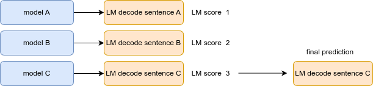

### 8th place solution (I don't know why this team was 7th place in leader board)

Thank you for organizing this competition.
I am new to speech recognition and have learned a lot. Thanks to the competition participants and hosts.

<b>Solution Overview</b>

- Dataset cleaning
- Punctuation
- Simple Ensemble (Rescoring)
  <b>Dataset</b>
  First, I applied a data filter. Since I'm not familiar with the audio domain, I used a simple filter.
  One was the ratio between the transcribed text and the length of the audio data. I filtered the data based on a 20 characters per audio second. If it's higher than that, I considered the possibility that there are too many characters for the length of the audio data. It could be abnormally fast speech or corrupted audio data.
  Another filter I used was based on the prediction results from the yellow_king model. I filtered out data with scores above a certain threshold (CER > 0.6).
  By training on clean data, I was able to start off with a good score.

Because the competition data set was so large, training was repeated on a subset of it rather than using all of it. Once the model achieved some performance, the WER for the remaining data set was calculated and added to the data. This round was repeated several times.

<b>external data</b>
kathbath, openslr37, 53, ulca
These external data were also filtered

<b>Model</b>
IndicWav2Vec
This model was very powerful for the test set.
Since the previous competition report suggested that retraining a model once it had converged would not perform well, I used a pre-trained model instead of bengali's fine-tuned checkpoints (converted to HF model from faireseq checkpoints). Another reason was that I customized vocab (Mentioned in the section on punctuation.).

<b>LM Model</b>
5-gram Language Model (using all of Indiccorpus v1 and v2, BangaLM, and mC4). The text corpus totaled 45GB, with the 5gram.bin file being around 22GB in size.
Using pyctcdecoder, alpha, beta and beam_width were adjusted with example audio CV. This initially provided a 0.01 boost to the LB score, but the benefit decreased as the score improved, eventually settling at around 0.003.

<b>Punctuation</b>
punctuation is very important.
Instead of creating a punctuation model, I took the simple approach of including punctuation in the vocab and LM corpus. Even when including punctuation, wav2vec was largely unable to predict it. However, it was found that including them in the vocab allowed them to be considered as candidates during LM decoding. Simply by including punctuation in both the model and the LM corpus, it was possible to improve the score from 0.44 to 0.428.

<b>Ensemble (Rescoring)</b>
Due to the structure of the output, it was not possible to simple ensemble at the logit level. Therefore, a strategy was adopted to calculate the LM Score for decoded sentences using the LM model, and the sentence with the highest score was selected.

Sentence used the output of three models with variations on training data and decoding parameters. Both public and private models improve by about 0.006 - 0.008.
<b> Not working for me </b>

- xls-r-300m
  - Common Voice's CV is competitive with indicwav2vec, but performs very poorly for the test set. Not effective when added to an ensemble.
- Speech Enhancement
  - It was found that the score was poor for example audio with reverb, so noise removal was performed using DeepFilterNet. There were cases where this boosted the LB score and cases where it didn't, so it was finally not used.
- Adding Assamese
  - my understanding is that it shares characters with Bengali. Addition did not improve score.
